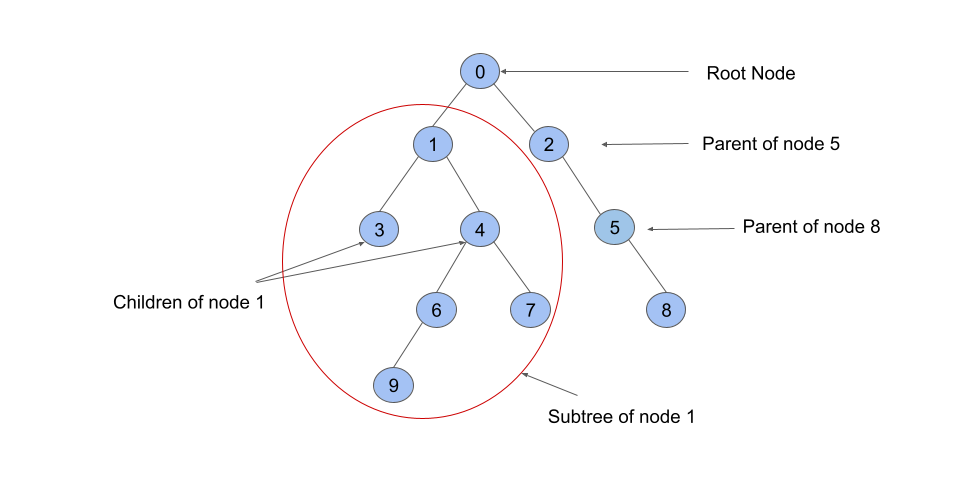

# **[1466\. Reorder Routes to Make All Paths Lead to the City Zero](https://leetcode.com/problems/reorder-routes-to-make-all-paths-lead-to-the-city-zero/)**

There are `n` cities numbered from `0` to `n - 1` and `n - 1` roads such that there is only one way to travel between two different cities (this network form a tree). Last year, The ministry of transport decided to orient the roads in one direction because they are too narrow.

Roads are represented by `connections` where `connections[i] = [ai, bi]` represents a road from city `ai` to city `bi`.

This year, there will be a big event in the capital (city `0`), and many people want to travel to this city.

Your task consists of reorienting some roads such that each city can visit the city `0`. Return the **minimum** number of edges changed.

It's **guaranteed** that each city can reach city `0` after reorder.


**Example 1:**


```
Input: n = 6, connections = [[0,1],[1,3],[2,3],[4,0],[4,5]]
Output: 3
Explanation: Change the direction of edges show in red such that each node can reach the node 0 (capital).

```

**Example 2:**


```
Input: n = 5, connections = [[1,0],[1,2],[3,2],[3,4]]
Output: 2
Explanation: Change the direction of edges show in red such that each node can reach the node 0 (capital).

```

**Example 3:**

```
Input: n = 3, connections = [[1,0],[2,0]]
Output: 0

```


**Constraints:**

- `2 <= n <= 5 * 104`

- `connections.length == n - 1`

- `connections[i].length == 2`

- `0 <= ai, bi <= n - 1`

- `ai != bi`


---


這題要讓所有的 node 都可以沿著箭頭找到 `0`，算出有幾個箭頭要轉向。

因為是衝著 DFS 找題目，所以知道要用 DFS 來解，第一次的解法很醜，效率也不好。

## 第一次嘗試

### 解題思路

- 用一個 Map(routeTable) 來記錄節點之間的關係，key 是目標節點，value 是一個存放著可以通往目標節點的 Set（其實只要用 Array 就可以了，原本以為會出現重複的狀況，所以想用 Set 來去除重複的節點，但其實應該不會重複），例如 `routeTable.get(0) → [1, 3]` 就表示節點 1 跟節點 3 都可以通往節點 0。

- 從節點 0 開始做 DFS，如果可以通往節點 0 的節點，箭頭有指向其他節點（代表可以通往其他節點），就應該把箭頭反過來，這樣那些節點才可以透過這個節點來前往節點 0。\
   更新 `routeTable` 及 `changeCnt`，並繼續對其他節點往下做 DFS。

   例如：`routeTable.get(0) → [1, 3]`、`routeTable.get(2) → [1]`，表示節點 1 可以通往節點 0 及節點 2，這時候應該要把節點 1 指向節點 2 的箭頭反轉，所以節點 2 就可以透過節點 1 前往節點 0。\
   然後繼續對節點 2 做 DFS。


```javascript
function minReorder(n: number, connections: number[][]): number {
  const routeTable = new Map<number, Set<number>>()
  connections.forEach(connection => {
    if (routeTable.has(connection[1])) {
      routeTable.get(connection[1])!.add(connection[0])
    }
    else {
      routeTable.set(connection[1], new Set([connection[0]]))
    }
  })

  let changeCnt = 0
  function dfs(target: number, parent: number | null) {
    if (routeTable.has(target)) {
      routeTable.get(target)!.forEach(node => {
        dfs(node, target)
      })
    }

    [...routeTable.entries()].forEach(([node, route]) => {
      if (route.has(target) && node !== parent) {
        route.delete(target)

        if (routeTable.has(target)) {
          const temp = routeTable.get(target)!
          temp.add(node)
        }
        else {
          routeTable.set(target, new Set([node]))
        }

        changeCnt++

        if (route.size === 0) {
          routeTable.delete(node)
        }

        dfs(node, target)
      }
    })
  }

  dfs(0, -1)
  return changeCnt
}
```


可以看到在 dfs function 裡面用到了 `[...routeTable.entries()].forEach` 註定這個解法的時間複雜度是 $O(N^2)$，Submit 的時候在 `n = 7650` 的 testcase 中得到了 **Time Limit Exceeded**。


## 第二次嘗試

### 解題思路

- 不額外建立 `routeTable`，直接操作 `connections`。

- 一樣從節點 0 開始做 DFS，迭代 `connections`，如果節點 0 在 `connection` 的第一個，代表節點 0 的箭頭指向別人，但我們想要讓所有節點都可以指向節點 0 或透過其他節點指向節點  0，所以要把 `connection` 對調，將 `changeCnt++` 之後繼續對節點 0 的相鄰節點做 DFS，直到所有節點都可以直接或間接指向節點 0。


```javascript
function minReorder(n: number, connections: number[][]): number {
  let changeCnt = 0

  function dfs(target: number, parent: number) {
    connections.forEach(connection => {
      if (!connection.includes(target)) return
      if (connection[0] === target && connection[1] === parent) return

      if (connection[0] === target) {
        [connection[0], connection[1]] = [connection[1], connection[0]]
        changeCnt++
      }

      dfs(connection[0], connection[1])
    })
  }

  dfs(0, -1)
  return changeCnt
}
```


邏輯看起來簡單多了，但其實還是一樣的問題，時間複雜度看起來還是 $O(N^2)$，不過這次在 `n = 18194` 的 testcase 得到了 **Time Limit Exceeded**，不確定是不是有減少了一些遞迴的次數。


## 放棄掙扎，偷看解答

思考很久還是沒辦法得到更好的方法，決定不浪費時間直接看解答了。

### 解題思路

- 我們要建立一個像這樣的樹狀結構

   

   （[圖片來源](https://leetcode.com/problems/reorder-routes-to-make-all-paths-lead-to-the-city-zero/editorial)）

- 如果加上方向

   

   （[圖片來源](https://leetcode.com/problems/reorder-routes-to-make-all-paths-lead-to-the-city-zero/editorial)）

- 建立一個 map(`Map<number, number[][]>`)，裡面放的是每個節點跟相鄰節點之間的關係，例如：

   ```javascript
   // 節點 0 跟相鄰節點的關係
   map.get(0) → [
     [1, 1], // 前面的 1 表示節點 1，後面的 1 表示節點 0 箭頭指向節點 1
     [3, 0]  // 前面的 3 表示節點 3，後面的 0 表示節點 3 箭頭指向節點 0
   ]
   ```

   用 0 跟 1 來表示箭頭指的方向的原因是，當節點 0 指向節點 1 的時候，要反轉過來將節點 1 指向節點 0，這時候我們會將反轉次數 +1，所以透過 0 跟 1 來表示需不需要反轉。

- 從節點 0 開始進行 DFS，迭代目前節點對各個相鄰節點的關係。注意，如果相鄰節點是母節點的話要跳過，避免重複搜尋。繼續對相鄰節點做 DFS，直到走訪過所有節點。


```javascript
function dfs(target: number, parent: number, map: Map<number, number[][]>, count: number) {
  map.get(target)!.forEach(([neighbor, relation]) => {
    if (neighbor === parent) return
    count = dfs(neighbor, target, map, count + relation)
  })
  return count
}

function minReorder(n: number, connections: number[][]): number {
  const map: Map<number, number[][]> = new Map()
  connections.forEach(connection => {
    if (!map.has(connection[0])) {
      map.set(connection[0], [])
    }
    map.get(connection[0])!.push([connection[1], 1])
    if (!map.has(connection[1])) {
      map.set(connection[1], [])
    }
    map.get(connection[1])!.push([connection[0], 0])
  })

  return dfs(0, -1, map, 0)
}
```


這個方法解決了我想不通的點：要怎麼紀錄相鄰節點之間的箭頭指向？因為我想不到方法，所以前兩個嘗試都只能迭代所有節點之間的關係去找到相反的箭頭。（寫到這裡突然想到，另外再做一個反向箭頭的 map 應該可以解決這個問題）

這個解法做到了時間複查度跟空間複雜度都是 $O(N^2)$


送出之後，我照往常一樣想看看用時最短的解法（雖然那個時間不太準），完全忘記我還想自己試看看用 BFS，結果就看到了感覺很聰明的方法，後來為了確保自己有學到這個解法，所以憑記憶寫了一次。


## BFS

### 解題思路

- 一樣的樹狀結構

   

   （[圖片來源](https://leetcode.com/problems/reorder-routes-to-make-all-paths-lead-to-the-city-zero/editorial)）

- 建立一個 Map，這個 Map 紀錄走訪過的節點，key 為目標節點，value 為目標節點的母節點，藉此紀錄節點的母節點是誰。

- 先 `map.set(0, 0)` 來做起始點，開始對 `connections` 裡的每個 `connection` 做檢查，會遇到三種狀況：

   1. `from` 節點已走訪過，但因為我們是從節點 0 開始走訪，且題目要所有節點都可以通往節點 0，所以已走訪過的節點應該要放在 `to` 的位置，才會讓所有節點都能到節點 0，所以要反轉這個 `connection` 並加入 Map，`count++`。

   2. `from` 節點還未走訪，不過 `to` 節點已走訪過，且這個 connection 也是正確的方向，直接加入 Map。

   3. `from` 跟 `to` 都還未走訪，先放進等待區 `nextQueue`，因為不會存在沒有連結的節點，只是目前還沒找到他們是誰的子節點，所以先把全部都走訪一次，再回來從新檢查這些節點。

   直到所有 `connection` 都檢查完畢，`count` 就是答案了。


```javascript
function minReorder(n: number, connections: number[][]): number {
  let queue = connections
  const map: Map<number, number> = new Map()
  let count = 0

  map.set(0, 0)
  while (queue.length > 0) {
    let nextQueue: number[][] = []
    queue.forEach(([from, to]) => {
      if(map.has(from)) {
        count++
        map.set(to, from)
      }
      else if (map.has(to)) {
        map.set(from, to)
      }
      else {
        nextQueue.push([from, to])
      }
    })

    queue = nextQueue
  }

  return count
}
```


這個解法我覺得非常聰明，完全不需要紀錄箭頭的方向，而是在走訪的過程中把樹建出來，順手就把箭頭反轉了。

不過其實上面的這段程式碼會在一種狀況下得到 **Time Limit Exceeded**，就是每次的 `nextQueue` 都只比原本的 `queue` 少一個。也就是說，每次的迭代都需要到最後一個才能找到已走訪過的節點，並把母節點與子節點的關係連上。

所以其實原解法還有一行是被我刪掉的：

```javascript
if (nextQueue.length > queue.length - 2) {
  nextQueue.reverse()
}
```


我一開始不理解為什麼要這樣做，直到我沒辦法通過上面說的 worst case。（或許改成 `queue.length - nextQueue.length === 1` 或是 `nextQueue.length + 1 === queue.length` 之類的會比較好懂？）

總之就是透過反轉整個 queue 來防止迭代後的進展不如預期。


不過有沒有可能第一次迭代是需要被反轉的，但因為我們迭代後才發現進展不如預期，結果反轉後反而把原本的 best case 變成 worst case？如果有的話又如何解決？


遇到再說吧


