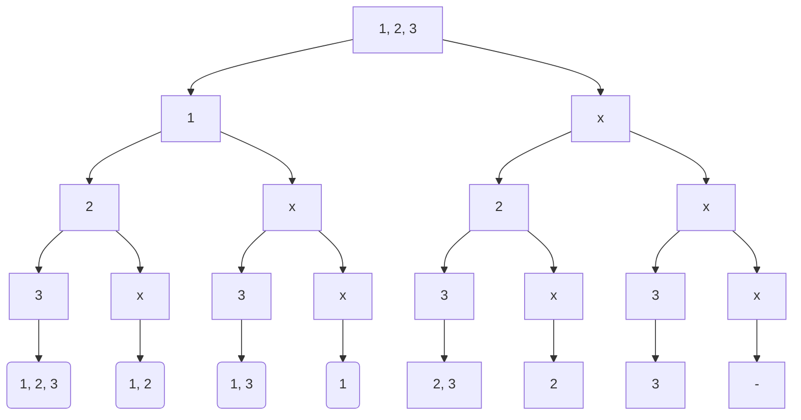

# [78. Subsets](https://leetcode.com/problems/subsets/)

#leetcode #medium 

Given an integer array `nums` of **unique** elements, return _all possible_ 

_subsets_

 _(the power set)_.

The solution set **must not** contain duplicate subsets. Return the solution in **any order**.

**Example 1:**

```
**Input:** nums = [1,2,3]
**Output:** [[],[1],[2],[1,2],[3],[1,3],[2,3],[1,2,3]]
```

**Example 2:**

```
**Input:** nums = [0]
**Output:** [[],[0]]
```

**Constraints:**

-   `1 <= nums.length <= 10`
-   `-10 <= nums[i] <= 10`
-   All the numbers of `nums` are **unique**.

---

## 題目意思

給一個 array of number，number 不重複，回傳所有的 subsets，不用考慮任何順序。
第一個想法就是跟 [[0046-permutations]] 似乎有點像，應該可以往這個方向思考。

## 解題方向

First try：

```javascript
var subsets = function(nums) {
  const result = []
  recursive(nums, result)
  return result
};

function recursive(subset, result) {
  if (subset.length === 0) return
  result.push(subset)
  for (let n = 0; n <= subset.length - 1; n++) {
    const subsetClone = [...subset]
    subsetClone.splice(n, 1)
    recursive(subsetClone, result)
  }
}
```

想法很簡單，就是用 recursive 把 nums 裡面的數一次拿掉一個，再丟進去 recursive 繼續丟，直到 recursive 接到的 input 是空陣列。
但這樣會有重複的問題：

```javascript
[
  [ 1, 2, 3 ], 
  [ 2, 3 ], [ 3 ], [ 2 ],
  [ 1, 3 ], [ 3 ], [ 1 ],
  [ 1, 2 ], [ 2 ], [ 1 ]
]
```

突然想到，[[0046-permutations]] 的解法，其實不需要特別移動要插入數字的位置，那這題是不是也不用特別移動要刪除的位置，所以改成這樣：

```javascript nums{3, 5}
var subsets = function(nums) {
  const result = []
  for (let n = 0; n <= nums.length - 1; n++) {
    recursive(nums, n, result)
  }
  return result
};

function recursive(subset, index, result) {
  result.push(subset)
  if (index > subset.length - 1) return
  const subsetClone = [...subset]
  subsetClone.splice(index, 1)
  recursive(subsetClone, index, result)
}
```

把 for loop 移出來，每次遞迴多傳一個 `index` 進去，由最上層的函數決定遞迴下去的時候要刪除第幾個數，所以每個直系遞迴（有這種講法嗎？）都會刪除同一個位置的數，結果就差一點點了！

```javascript
[
  [ 1, 2, 3 ], [ 2, 3 ], [ 3 ], [],
  [ 1, 2, 3 ], [ 1, 3 ], [ 1 ],
  [ 1, 2, 3 ], [ 1, 2 ]
]
```

`[1, 2, 3]` 會一直出現，然後還差一個 `[2]`。

想半天還是想不出來怎麼解，直接找答案，看到一個簡單明瞭的，還附圖：

```javascript
var subsets = function(nums) {
  const result = []
  function recursive(nums, idx, auxArr) {
    if (idx === nums.length) {
      result.push(auxArr)
      return
    }
    // take it
    recursive(nums, idx + 1, [...auxArr, nums[idx]])
    // don't take
    recursive(nums, idx + 1, auxArr)
  }
  recursive(nums, 0, [])
  return result
}
```

簡單來說就是每個數都分成拿或不拿，就可以順利的把全部組合列出來了，上圖：



本來是用 monospace 畫圖的，突然想到可以用 mermaid 來畫，雖然還是不太方便啦，但至少畫出來比較好看。